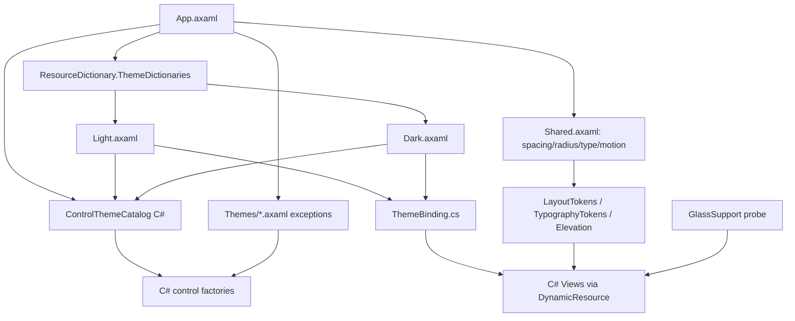

# Requirements

### Overview & Goals
Raise the Zaide UI from a "framework default" look to the finish quality of Linear / Zed / Cursor. Switch the default theme to **light (white)**, but not by editing color values: rebuild **the mechanism that resolves colors** and add a **shared control layer**.

### Confirmed Decisions
1. **Design both light and dark ramps in this refactor.** The user-facing theme switcher and persistence remain a separate parallel phase.
2. Keep `concept.png` and the dark-navy palette table in `DESIGN.md §8` — **archive** them under `docs/refactor/refactor-10/archive/` instead of deleting, and update `DESIGN.md` to the new token system.
3. The current content of `docs/refactor/refactor-10/IMPLEMENTATION_PLAN.md` (F8 image preview / accessibility) is a **placeholder to ignore**; rewrite it fully. Image preview and accessibility move to separate phases.
4. Reference direction: the restrained density of Linear / Zed / Cursor plus an Apple (Xcode) style glass texture. Direction, not imitation.
5. Glass/blur is **in scope**, with an opaque fallback where blur is unavailable (`DESIGN.md §2`).
6. The control layer is a **C#-first hybrid** — composition and states live in C# factories and code-built `ControlTheme` objects; XAML is limited to cases where template replacement is unavoidable (scrollbars, Semi overrides).

### Scope

**In Scope**
- Variant-aware theme infrastructure (`ThemeDictionaries` Light/Dark, `DynamicResource` consumption)
- Semantic token redesign (surface / border / text / accent / state) plus a typography scale and elevation
- Light and dark ramps designed together, verified against WCAG AA
- Replacing ~100 hardcoded color literals and 38 raw `new Thickness(` calls with tokens
- Removing `static readonly` brush caches that block theme switching
- Shared control layer: buttons, list rows, panel headers, inputs, scrollbars with unified states
- Glass surfaces with fallback, plus shadow / radius / transition policy

**Out of Scope**
- Theme switcher UI, settings persistence, OS theme following → separate parallel phase
- F8 image preview → separate phase
- Full accessibility work (screen reader, keyboard navigation) → separate phase; focus rings are still included in the control layer
- New features or backend logic changes

### User Stories
- As a developer, I want a white UI that stays readable without glare in a bright workspace.
- As a developer, I want every button and list row to react **identically** (today they differ per panel).
- As a maintainer, I want a color change in one place to propagate across the whole app.

### Acceptance Criteria
- The hardcoded `RequestedThemeVariant="Dark"` is removed and Light renders by default.
- Zero color literals in `src/**/*.cs` (excluding tests), enforced by a guard script.
- Zero `static readonly` brush fields.
- Contrast ratio ≥ 4.5:1 for body text and ≥ 3:1 for secondary text and borders.
- `dotnet test Zaide.slnx --no-build` passes in full.

# Technical Design

### Current Implementation (investigation findings)
- `src/App/Composition/App.axaml:5` — `RequestedThemeVariant="Dark"` is hardcoded. FluentTheme + Semi.Avalonia + AvaloniaEdit styles are included.
- `App.axaml:11-61` — a flat dictionary of `<Color>` plus `<SolidColorBrush ... {StaticResource}>`. No `ThemeDictionaries`, zero `ThemeVariantScope`, zero `DynamicResource`.
- `src/UI/DesignSystem/PaletteTokens.cs` — runtime lookup via `Application.Current.Resources[...]` with hardcoded fallbacks. Values are resolved once, so variant changes never propagate.
- `TypographyTokens.cs` — only one token, `FontSizeSm` (12). Effectively no scale.
- ~100+ hardcoded colors. Top offenders: `SettingsFontPicker.cs` (15), `SourceControlPanel.cs` (14), `FileTreeView.cs` (12), `TownhallView.cs` (8), `CommandPaletteOverlay.cs` (8), `AgentMemoryPanel.cs` (6), `AgentBackendBindingPanel.cs` (6), `StatusBar.cs` (6), `BottomPanelHost.cs` (6).
- `static readonly` brushes that block theme switching: `BreakpointMargin.cs:21-27`, `InstructionPointerMargin.cs:14`, `TerminalRenderControl.cs:186-195`, `TownhallNavigationPanel.cs:25-26`.
- No central `ControlTheme` / `Styles` layer — hover and pressed states are hand-wired in each panel's code-behind. Zero shadow/elevation usage (fully flat).
- 38 raw `new Thickness(` calls even though spacing tokens exist.

### Key Decisions
1. **Variant awareness via `ThemeDictionaries`** — split the flat dictionary in `App.axaml` into `Light` and `Dark` entries under `ResourceDictionary.ThemeDictionaries`. Both ramps are designed now; the switching trigger (settings UI) belongs to the next phase.
2. **All consumption through `DynamicResource`** — XAML uses `DynamicResource`; C# views bind through a `ThemeBinding.Apply` helper (`control[!Property] = new DynamicResourceExtension("Key")`). The immediate-lookup properties in `PaletteTokens` are replaced by this helper and the hardcoded fallback constants are removed.
3. **Hybrid control layer, weighted toward C#** — static factories in `src/UI/DesignSystem/Controls/` (`AppButton`, `ListRow`, `PanelChrome`, `AppTextBox`) compose controls, while `ControlTheme` / `Style` objects built in code are registered into app resources by `ControlThemeCatalog`. XAML is reserved for cases where a template must be replaced — effectively only `Themes/Scrollbars.axaml` and `Themes/SemiOverrides.axaml`.
4. **Glass as progressive enhancement** — `TransparencyLevelHint` plus translucent surface brushes, falling back to opaque tokens when blur is unsupported. Tokens are defined in pairs (`SurfaceGlassBrush` / `SurfaceGlassFallbackBrush`) and selected at runtime.

### Proposed Token System

 Group | Keys | Notes |
---|---|---|
 Surface | `SurfaceCanvas`, `SurfaceRaised1~3`, `SurfaceGlass`, `SurfaceOverlay` | 4 elevation tiers plus glass |
 Border | `BorderSubtle`, `BorderDefault`, `BorderStrong`, `BorderFocus` | 1px, translucent |
 Text | `TextPrimary`, `TextSecondary`, `TextTertiary`, `TextOnAccent`, `TextDisabled` | 3-level hierarchy |
 Accent | `Accent`, `AccentHover`, `AccentPressed`, `AccentSubtleBg` | state derivatives |
 State | `Success`, `Warning`, `Danger`, `Info`, `Idle` plus `*SubtleBg` | badges and dots |
 Interaction | `OverlayHover`, `OverlayPressed`, `OverlaySelected` | translucent overlays on surfaces |
 Elevation | `ShadowSm`, `ShadowMd`, `ShadowLg` (`BoxShadows`) | depth |
 Typography | `FontSizeXs/Sm/Md/Lg/Xl`, `LineHeight*`, `FontWeight*` | restored scale |

### File Structure
```
src/App/Composition/App.axaml            # ThemeDictionaries entry point, RequestedThemeVariant removed
src/UI/DesignSystem/Tokens/Light.axaml   # light ramp (new)
src/UI/DesignSystem/Tokens/Dark.axaml    # dark ramp (new; inherits and cleans up current navy)
src/UI/DesignSystem/Tokens/Shared.axaml  # spacing/radius/typography/motion (variant-agnostic)
src/UI/DesignSystem/Controls/ControlThemeCatalog.cs # C# ControlTheme definition and registration (new)
src/UI/DesignSystem/Controls/AppButton.cs      # primary/secondary/icon factory (new)
src/UI/DesignSystem/Controls/AppTextBox.cs     # input/search field factory (new)
src/UI/DesignSystem/Controls/ListRow.cs        # list/tree row factory (new)
src/UI/DesignSystem/Controls/PanelChrome.cs    # panel header/divider factory (new)
src/UI/DesignSystem/Themes/Scrollbars.axaml    # exception requiring template replacement (new)
src/UI/DesignSystem/Themes/SemiOverrides.axaml # Semi default key overrides (new)
src/UI/DesignSystem/ThemeBinding.cs      # C# -> DynamicResource helper (new)
src/UI/DesignSystem/PaletteTokens.cs     # fallbacks removed, delegates to ThemeBinding
src/UI/DesignSystem/TypographyTokens.cs  # scale expanded
src/UI/DesignSystem/Elevation.cs         # BoxShadows token accessors (new)
scripts/check-theme-tokens.sh            # guard for color/Thickness literals (new)
docs/DESIGN.md                           # §8 palette table replaced
docs/refactor/refactor-10/archive/       # legacy palette table and concept.png references
```

### Architecture Diagram


### Risks
 Risk | Mitigation |
---|---|
 Semi.Avalonia defaults override our colors in light | Place token dictionaries **after** the Semi include and explicitly override conflicting keys |
 AvaloniaEdit editor colors drift from the app palette | Define editor highlighting per variant, not just `SearchPanel*` |
 Terminal renderer relies on static brushes for performance | Keep the brush cache but invalidate it on `ActualThemeVariantChanged` |
 Visual regressions from bulk replacement | Migrate in file groups, compare screenshots, run the guard script |
 Blur unsupported by the Linux compositor | Opaque fallback tokens; verify the UI looks correct without blur |

# Testing

### Validation Approach
- **Guard script**: `scripts/check-theme-tokens.sh` detects `Color.Parse`, `Color.FromArgb`, `Brushes.`, `#`-hex literals and raw `new Thickness(` in `src/**/*.cs`, following the existing `check-animations.sh` pattern. Wired into the Makefile and CI.
- **Unit tests** added under `tests/Zaide.Tests/UI/DesignSystem/`:
  - Light and Dark dictionaries expose an identical key set (detects missing keys).
  - Contrast ratio computed for key text/background pairs and asserted against AA thresholds.
  - `ThemeBinding.Apply` actually updates values when the variant changes.
- **Manual check**: run the app and compare screenshots of the main screens (file tree, editor, terminal, source control, Townhall, command palette, settings).
- Full suite: `dotnet test Zaide.slnx --no-build` in an interactive terminal.

### Key Scenarios
- On default startup every panel renders in the light ramp with no leftover navy blocks.
- Forcing the variant to Dark from code updates all panels **without a restart** (catches static brush regressions).
- Buttons and list rows show identical hover / pressed / focus feedback across every panel.
- The focus ring is always visible during keyboard Tab navigation.

### Edge Cases
- Glass surfaces fall back to opaque where blur is unsupported, keeping text readable.
- Terminal and editor syntax highlighting stays legible on a light background.
- Debug margins (breakpoints, instruction pointer) remain identifiable in light.
- No layout breakage at 800x600 (DESIGN.md checklist).

# Delivery Steps

### ✓ Step 1: Rewrite the plan document and archive the legacy palette
The refactor-10 docs reflect the real goal (theming and control layer) and the legacy dark palette is preserved but separated.

- Fully rewrite `docs/refactor/refactor-10/IMPLEMENTATION_PLAN.md` in English; remove the F8 image preview / accessibility content and note it moved to separate phases.
- Create `docs/refactor/refactor-10/archive/legacy-navy-palette.md` preserving the `DESIGN.md §8` palette table and the `concept.png`-based decisions verbatim.
- Create `docs/refactor/refactor-10/TOFIX.md` as the work board.
- Fix milestones (M1-M5), their verification method, and the file list for each in the document.
- Commit these three paths alone (`git add docs/refactor/refactor-10 && git commit`) as a docs-only commit and push to `origin/master`; leave the unrelated Phase 23 F7 changes untouched in the working tree.

###   Step 2: Build the theme variant infrastructure
The app runs on `ThemeDictionaries` and a runtime variant switch actually propagates to the screen.

- Delete the orphaned `src/UI/DesignSystem/Tokens/Dark.axaml` and `Tokens/Shared.axaml` stubs left by the aborted code start, so the split begins from the committed `App.axaml` state.
- Split the flat resources in `App.axaml` into `src/UI/DesignSystem/Tokens/Light.axaml`, `Dark.axaml` and `Shared.axaml`, grouped under `ResourceDictionary.ThemeDictionaries`.
- Remove `RequestedThemeVariant="Dark"` and default to Light.
- Add `ThemeBinding.cs` — a helper that binds brush properties from C# views via `DynamicResourceExtension`.
- Remove the hardcoded fallback constants in `PaletteTokens.cs` and replace immediate-lookup properties with `ThemeBinding` delegation.
- Replace the `static readonly` brushes in `BreakpointMargin.cs`, `InstructionPointerMargin.cs`, `TerminalRenderControl.cs` and `TownhallNavigationPanel.cs` with instance caches invalidated on variant change.
- Add a test asserting the Light and Dark key sets match.

###   Step 3: Redesign semantic tokens and author both ramps
Surface, border, text, accent, state, elevation and typography tokens exist and both ramps satisfy WCAG AA.

- Define every key in `Light.axaml` and `Dark.axaml` per the token table in Technical Design (identical key sets).
- Design the light ramp as four low-saturation neutral grey tiers with a restrained accent, in the Linear/Zed/Cursor direction; carry the existing navy into the dark ramp under the new key system.
- Expand `TypographyTokens.cs` to five sizes plus line-height and weight, and wire it into `TextStyles`.
- Add `Elevation.cs` with `ShadowSm/Md/Lg` BoxShadows accessors.
- Add contrast-ratio tests under `tests/Zaide.Tests/UI/DesignSystem/`.
- Replace the `docs/DESIGN.md §8` palette table with the new token system.

###   Step 4: Replace hardcoded colors and spacing, and add the guard
View code contains no color literals or raw Thickness values, and a script prevents regressions.

- Migrate the top offenders first: `SettingsFontPicker.cs` (15), `SourceControlPanel.cs` (14), `FileTreeView.cs` (12), `TownhallView.cs` (8), `CommandPaletteOverlay.cs` (8), then the remaining files.
- Align the 38 raw `new Thickness(` calls to the `LayoutTokens` spacing scale.
- Add `scripts/check-theme-tokens.sh` detecting color literals and raw Thickness, following the `check-animations.sh` pattern.
- Wire the guard into the `Makefile` and the CI verification path.
- After each file group, verify visually via screenshots of the affected screen.

###   Step 5: Build the shared control layer
Buttons, inputs, list rows and scrollbars are unified in a central control layer, and hand-rolled hover code is removed from panels.

- Add `src/UI/DesignSystem/Controls/ControlThemeCatalog.cs` — build `ControlTheme` / `Style` / `Setter` objects **in C#** to declare hover, pressed, selected, focus and disabled states, and register them into app resources.
- Add factories `AppButton.cs` (primary/secondary/icon), `AppTextBox.cs`, `ListRow.cs`, and `PanelChrome.cs` (header, 1px divider, empty state).
- Keep only `Themes/Scrollbars.axaml` and `Themes/SemiOverrides.axaml` in XAML where template replacement is unavoidable, and include them from `App.axaml`.
- Reference state colors via the `OverlayHover` / `OverlayPressed` / `OverlaySelected` tokens through `DynamicResource`.
- Apply a consistent `BorderFocus`-based focus ring across all controls.
- Replace code-behind hover logic in `SourceControlPanel`, `FileTreeView`, `TownhallView`, `BottomPanelHost`, `NavBar` and `StatusBar` with factory calls and `Classes` assignment.

###   Step 6: Glass surfaces plus depth and motion polish
Panels and overlays gain blur-based texture and restrained shadows, and still render correctly where blur is unavailable.

- Set `TransparencyLevelHint` on `MainWindow` and add a `GlassSupport` probe that detects whether it actually applied.
- Introduce `SurfaceGlass` / `SurfaceGlassFallback` tokens and apply them to the command palette, overlays and sidebar, falling back to opaque when unsupported.
- Apply `ShadowSm/Md/Lg` to overlays, floating panels and dropdowns to establish a depth hierarchy.
- Unify corner radii on `RadiusSm`-`RadiusXl` and replace heavy panel borders with 1px subtle borders or spacing.
- Apply 150-200ms cubic-eased transitions to hover and focus changes (DESIGN.md §4).
- Verify the main screens with and without blur, then confirm `dotnet test Zaide.slnx --no-build` passes in full.