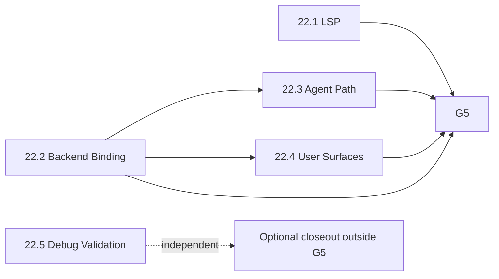

# Phase 22: Post-Closeout Product-Reality Corrective Program — Implementation Plan

## Status and Authorization

Phase 22 implementation is **in progress** through sub-phases 22.1 and 22.2.
Human G2 / M0 acceptance is recorded for 22.2; M1–M4 implementation and a
prior closeout cycle are delivered. A post-closeout package-2 audit identified a
blocking ACP runtime-invalidation defect; corrective work is in progress and
package-level PASS for 22.2 is not restored until targeted evidence refresh and
re-audit complete. No sub-phase beyond the corrective 22.2 slice authorizes
22.3, 22.4, 22.5, G5, or V4 from this document alone.

Phase 22 is part of Roadmap V3 as a post-closeout corrective program. The
Phase 21 technical closeout remains a historical fact. It is not product-
readiness acceptance.

## Governing Evidence

- [A4 gap report §9 and §10](../../../audits/v1-v3-product-reality/A4_GAP_REPORT.md#9-corrective-work-required-before-v4-planning)
  owns the corrective package ledger and the Partial-proceed decision.
- [Audit plan](../../../audits/v1-v3-product-reality/AUDIT_PLAN.md) preserves
  the distinction between audit evidence, corrective ownership, and later
  authorization.
- [Goal matrix](../../../audits/v1-v3-product-reality/GOAL_MATRIX.md) owns the
  accepted user-goal IDs.
- [A3 clean-profile closeout](../../../audits/v1-v3-product-reality/evidence/A3_CLEAN_PROFILE_SMOKE.md)
  owns the baseline row classifications and smoke evidence links.
- [Roadmap V3](../../../roadmap/V3.md) owns the Phase 22 outcome, ordering, and
  dependencies.

These sources are inputs. Phase 22 plans link to them and do not rewrite A0–A3
evidence.

## Goal

Close A4 corrective packages 1–7 through five coherent sub-phases, re-smoke
the affected A3 rows after each implemented sub-phase, and pass a final full
affected-row matrix before a human may reconsider V4 or successor-roadmap
planning.

## Boundaries

- Native Harness and ACP remain independent sibling backends with equal,
  truthful product treatment.
- The Phase 17 broker and permission model remain the mandatory action path;
  `AgentPermissionDecision.TryConsume()` remains the final authorization step.
- Phase 21 trace, usage, continuity, and memory contracts remain authoritative;
  user surfaces must not weaken redaction, evidence, retention, identity,
  recovery, or scope rules.
- Every independently implemented sub-phase begins with its own M0 live-seam
  verification and plan-acceptance gate.
- Each implementation requires explicit human approval after M0 acceptance.
- Every runtime re-smoke uses the preserved A3 isolation model in
  [Re-smoke Contract](#re-smoke-contract).

## Non-Goals

- V4 or successor-roadmap planning, implementation, or automatic start.
- Reopening or rewriting A0–A3 audit evidence.
- Treating this plan, its audit, or an accepted M0 as implementation approval.
- A4 package 9 medium-friction work. It remains issue/deferred work outside the
  Phase 22 critical path.
- Replacing the Native Harness with ACP, wrapping ACP in the Native Harness, or
  introducing implicit fallback between them.
- Real-profile smoke, the Zaide repository as a runtime fixture, xdtools, or
  manual desktop smoke unless a later explicit human decision changes the
  locked A3 model.

## Sub-Phase Index and Dependencies

| Sub-phase | A4 package ownership | Dependency | G5 critical |
|-----------|----------------------|------------|-------------|
| [22.1 Language intelligence / LSP](../phase-22.1/IMPLEMENTATION_PLAN.md) | 1 | None; parallel with 22.2 | Yes |
| [22.2 User backend-binding workflow](../phase-22.2/IMPLEMENTATION_PLAN.md) | 2 | None; parallel with 22.1 | Yes |
| [22.3 Agent-path enablement](../phase-22.3/IMPLEMENTATION_PLAN.md) | 3, 5, 6, 7 | 22.2 | Yes |
| [22.4 Trace / memory / usage user surfaces](../phase-22.4/IMPLEMENTATION_PLAN.md) | 4 | 22.2 | Yes |
| [22.5 Debug positive path / NetCoreDbg host validation](../phase-22.5/IMPLEMENTATION_PLAN.md) | 8 | None; independent | **No — optional** |



22.1 and 22.2 may proceed in parallel after their independent approval gates.
22.3 and 22.4 must not begin implementation until 22.2 is complete and its
affected local re-smoke has been recorded.

## A4 Package and A3 Goal Mapping

| A4 package | Ledger / findings | Key A3 goal IDs | Owner | Required re-smoke |
|------------|-------------------|-----------------|-------|-------------------|
| 1 — LSP runtime fixes | BL-01…BL-05 | `A1-FN-09`…`A1-FN-13` | 22.1 | Language-intelligence slice |
| 2 — User backend binding | BL-06, `A1-XX-01`; enables the BL-07 cascade | `A1-AC-02`; backend-bound sub-paths of `A1-AS-02`, `A1-TH-05`, `A1-MR-03`, `A1-TC-01`, and `A1-TP-01`…`03` | 22.2 | Binding and newly reachable dependent preflight rows |
| 3 — Send/routing failure projection | BL-07, HI-04, HI-08 | `A1-AS-02`, `A1-TH-05`, `A1-MR-03` | 22.3 | Send, routing, and Townhall outcome rows |
| 4 — Trace/memory/usage surfaces | BL-09…BL-11, `A1-XX-03` | `A1-TC-02`, `A1-TC-03`, `A1-TC-08` | 22.4 | Trace, memory, and usage rows |
| 5 — Explicit termination UI | BL-14 | `A1-TC-09` | 22.3 | Termination row |
| 6 — Tools/permissions smoke path | BL-08, HI-09, HI-10 | `A1-TP-01`…`A1-TP-03` | 22.3 | Tools, permissions, mutation rows |
| 7 — Interrupted-run positive smoke | BL-13, MD-13 | `A1-TC-05` | 22.3 | Restart/recovery row |
| 8 — Debug positive validation | BL-12, `A1-XX-04` | `A1-DB-01` | 22.5 | Debug row; optional and outside G5 |
| 9 — Medium-friction backlog | A4 §5.3 | As assigned by issue/deferred owners | Outside Phase 22 critical path | Not part of G5 |

The mapping identifies ownership and future smoke targets; it does not upgrade
any A3 classification or claim that a live seam currently satisfies the row.

## Gates

### G1 — Planning Docs Complete

Required artifacts:

- this umbrella plan and `TOFIX.md`;
- plans and `TOFIX.md` files for 22.1–22.5;
- the Phase 22 Roadmap V3 outcome/dependency update;
- the phase index update;
- relative-link validation and `git diff --check`;
- zero source, test, package, or audit-evidence edits.

Completing G1 means the planning set is ready for a separate human audit. It
does not accept any sub-phase M0 or authorize implementation.

### G2 — M0 / Plan Acceptance per Sub-Phase

Before a sub-phase can request implementation approval, its M0 must:

1. verify the plan's named production, DI, presentation, test, and A3 harness
   seams against the then-current checkout;
2. replace any stale candidate seam or command with live truth;
3. lock the smallest coherent milestone boundary and dependency state;
4. define exact focused, build, fast-suite, serial-fallback, and A3 re-smoke
   commands;
5. identify preservation tests and rollback boundaries;
6. receive explicit human plan acceptance.

No G2 acceptance is recorded in this planning session. **22.2 G2 / M0
acceptance is recorded** in [phase-22.2 M0](./phase-22.2/M0_SEAM_VERIFICATION.md)
and implementation M1–M4 plus corrective runtime-invalidation work are tracked in
[phase-22.2 TOFIX](./phase-22.2/TOFIX.md).

### G3 — Implementation Approval per Sub-Phase

After G2, a human must explicitly authorize implementation for that named
sub-phase. Approval for one sub-phase does not authorize any sibling or later
sub-phase. An accepted M0 alone is not implementation approval.

### G4 — Local Affected-Row Re-Smoke

After each approved sub-phase is implemented and its code/test gates pass, run
the affected A3 rows listed in the package mapping with the preserved A3
contract. Record observed classifications and evidence without rewriting the
historical A0–A3 files. A failed or incomplete affected row blocks that
sub-phase's closeout and downstream dependents.

### G5 — Critical-Path Completion and Full Affected Re-Smoke

G5 requires all of the following:

- A4 packages 1–7 are implemented, verified, and accepted through their owning
  sub-phases;
- the full affected matrix is re-run: `A1-FN-09`…`A1-FN-13`, `A1-AC-02`,
  `A1-AS-02`, `A1-TH-05`, `A1-MR-03`, `A1-TC-01` (backend-bound sub-path),
  `A1-TP-01`…`A1-TP-03`, `A1-TC-02`, `A1-TC-03`, `A1-TC-05`, `A1-TC-08`, and
  `A1-TC-09`;
- every required positive path has current evidence, and any remaining
  limitation is truthfully classified rather than inferred from wiring;
- a human reviews the complete matrix and records the gate result.

Package 8 / Phase 22.5 is optional and is not required for G5. Passing G5
permits only a new human decision about whether to begin V4 or successor-
roadmap planning. It does not start or pre-authorize that work.

## Re-smoke Contract

All Phase 22 re-smoke work must preserve the A3 model:

- use an out-of-tree Avalonia.Headless harness and a disposable runtime
  workspace;
- create scenario-local `HOME`, `XDG_CONFIG_HOME`, `XDG_DATA_HOME`,
  `XDG_STATE_HOME`, and `XDG_CACHE_HOME` values;
- compose the application through production DI, following the audited
  `Program.ConfigureServices(IServiceCollection)` pattern with only the
  documented test-safe scheduler substitution;
- never read, copy, or mutate a real user profile or store;
- never use the Zaide repository as the runtime fixture;
- clean up scenario state after the evidence has been retained;
- do not substitute source wiring or unit tests for user-observable smoke;
- do not use xdtools or manual desktop smoke unless a later explicit human
  decision changes this contract.

No re-smoke is executed in this planning session.

## Verification Framework for Later Implementation

Each sub-phase M0 must replace placeholders with exact filters and harness
commands before implementation approval. The common gates are:

```bash
dotnet build Zaide.slnx
dotnet test tests/Zaide.Tests/Zaide.Tests.csproj --no-build --filter "<sub-phase focused filter>"
dotnet test Zaide.slnx --no-build
dotnet test Zaide.slnx --no-build --settings tests/Zaide.Tests/slow.runsettings
<out-of-tree A3 producer command with disposable HOME/XDG and workspace>
git diff --check
```

Run the fast suite interactively. Use the serial command if fast mode fails or
hangs before classifying a regression.

## Rollback Plan

Prefer one reviewable commit per independently accepted sub-phase milestone.
Rollback is by reverting only the owning milestone commit and restoring the
previous A3 classification/evidence state; never roll back unrelated completed
V3 history. If an implementation changes persistence or schema, its sub-phase
M0 must add exact backup, migration, compatibility, and revert procedures
before approval.

## Planning-Session Boundary

This session creates documentation only. It does not edit production code,
tests, tools, packages, NuGet state, audit evidence, or `.claude/`; it does not
run implementation verification or smoke; and it does not accept G2, approve
implementation, or begin V4 planning.
